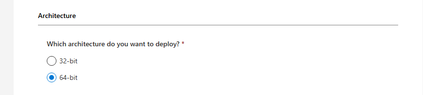

# Microsoft Office Deployment Tool Setup Guide

This guide explains how to download, configure, and install Microsoft Office using the Office Deployment Tool and a custom configuration XML file.

---

## Step 1: Create Configuration File

Use the Microsoft Office Customization Tool:

Configuration Tool:  
https://config.office.com/deploymentsettings

### Configuration Steps:

1. **Architecture**
   - Select your preferred architecture:
     - `64-bit` (Recommended)
     - `32-bit`

     

2. **Products**
   - Select:
     - Office Suites → **Office Professional Plus (Volume License)**

3. **Language**
   - Select:
     - English

4. **Export Configuration**
   - Click **Export**
   - Save the file as:
     ```
     Configuration.xml
     ```
   - Place it inside your Office setup folder (example: `C:\MS OFFICE SETUP`)

---

## Step 2: Download Office Deployment Tool

Download the tool from Microsoft:

https://www.microsoft.com/en-us/download/details.aspx?id=49117

### After downloading:

1. Run the downloaded file
2. Extract contents to:
