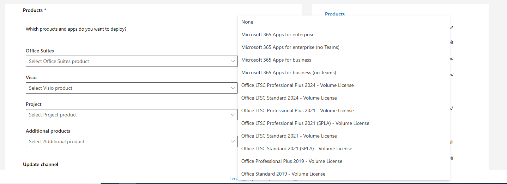
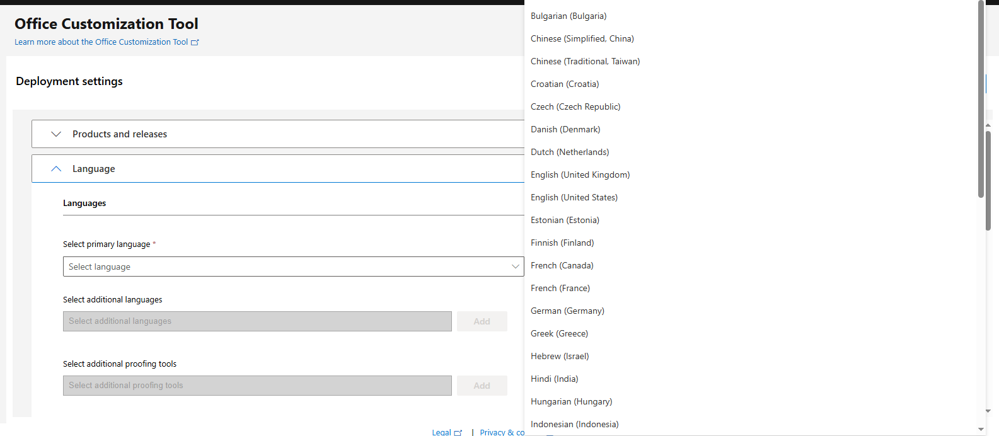
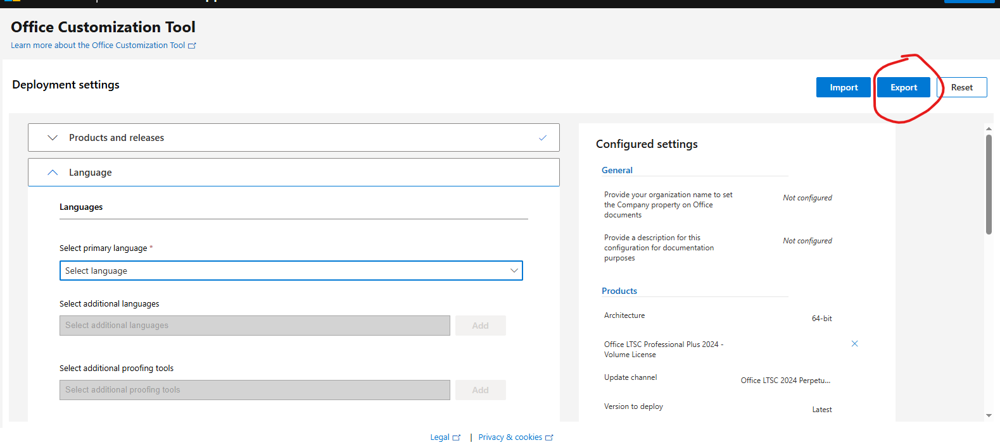

# Microsoft Office Deployment Tool Setup Guide

This guide explains how to download, configure, and install Microsoft Office using the Office Deployment Tool and a custom configuration XML file.

---

## Step 1: Create Configuration File

Use the Microsoft Office Customization Tool:

Configuration Tool:  
https://config.office.com/deploymentsettings

### Configuration Steps:

1. **Architecture**
   - Select your preferred architecture:
     - `64-bit` (Recommended)
     - `32-bit`


2. **Products**
   - Select:
     - Office Suites → **Office Professional Plus (Volume License)**


3. **Language**
   - Select:
     - English

4. **Export Configuration**
   - Click **Export**

   - Save the file as:
     ```
     Configuration.xml
     ```
   - Place it inside your Office setup folder (example: `C:\MS OFFICE SETUP`)

---

## Step 2: Download Office Deployment Tool

Download the tool from Microsoft:

https://www.microsoft.com/en-us/download/details.aspx?id=49117

### After downloading:

1. Run the downloaded file
2. Extract contents to:

 - Place it inside your Office setup folder (example: `C:\MS OFFICE SETUP`)


 Here is the improved **README.md section with complete CMD commands**, including download, install, and optional activation preparation:

````md
## COMMANDS IN CMD

Run Command Prompt (CMD) as Administrator, then execute the following commands:

### Step 1: Go to Root Directory
Navigate to the root of drive C:

```cmd
CD\
````

---

### Step 2: Go to Office Setup Folder

Change directory to your Office Deployment Tool folder:

```cmd
CD "C:\MS OFFICE SETUP"
```

---

### Step 3: Download Office Installation Files (Recommended for Offline Install)

This will download all required Office installation files based on your Configuration.xml:

```cmd
Setup.exe /download Configuration.xml
```

Wait until the download completes. This may take several minutes depending on your internet speed.

---

### Step 4: Install Microsoft Office (Silent Installation)

Run the configuration command to install Office silently:

```cmd
Setup.exe /configure Configuration.xml
```

This will install:

* Office Professional Plus (Volume License)
* Selected language (English)
* Selected architecture (32-bit or 64-bit)

No user interaction is required.

---

### Optional: Check Installation Folder

After download, your folder should look like this:

```
C:\MS OFFICE SETUP\
│-- setup.exe
│-- Configuration.xml
│-- Office\
│   └── (installation files)
```

---

### Notes

* Always run CMD as Administrator
* Do not close CMD during download or installation
* Internet is required for the download step
* Installation runs silently in the background

```
 